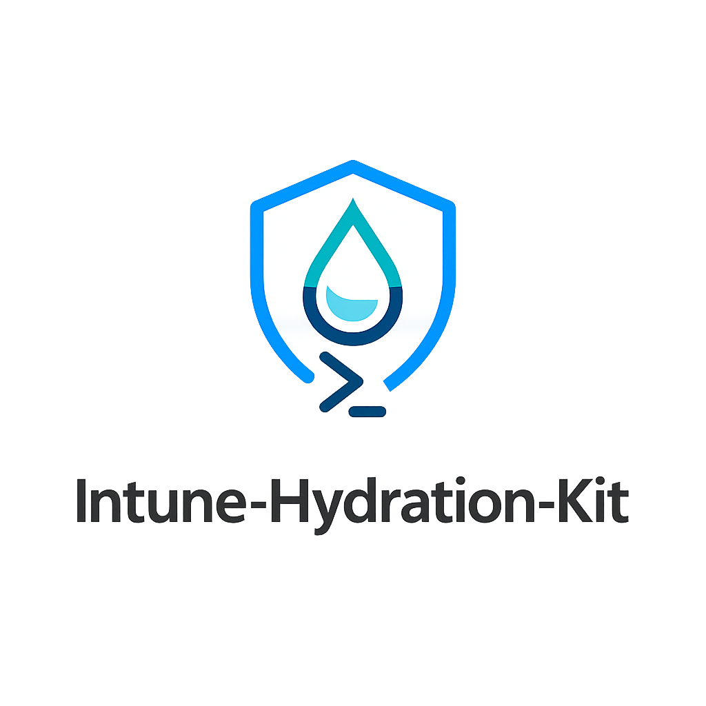
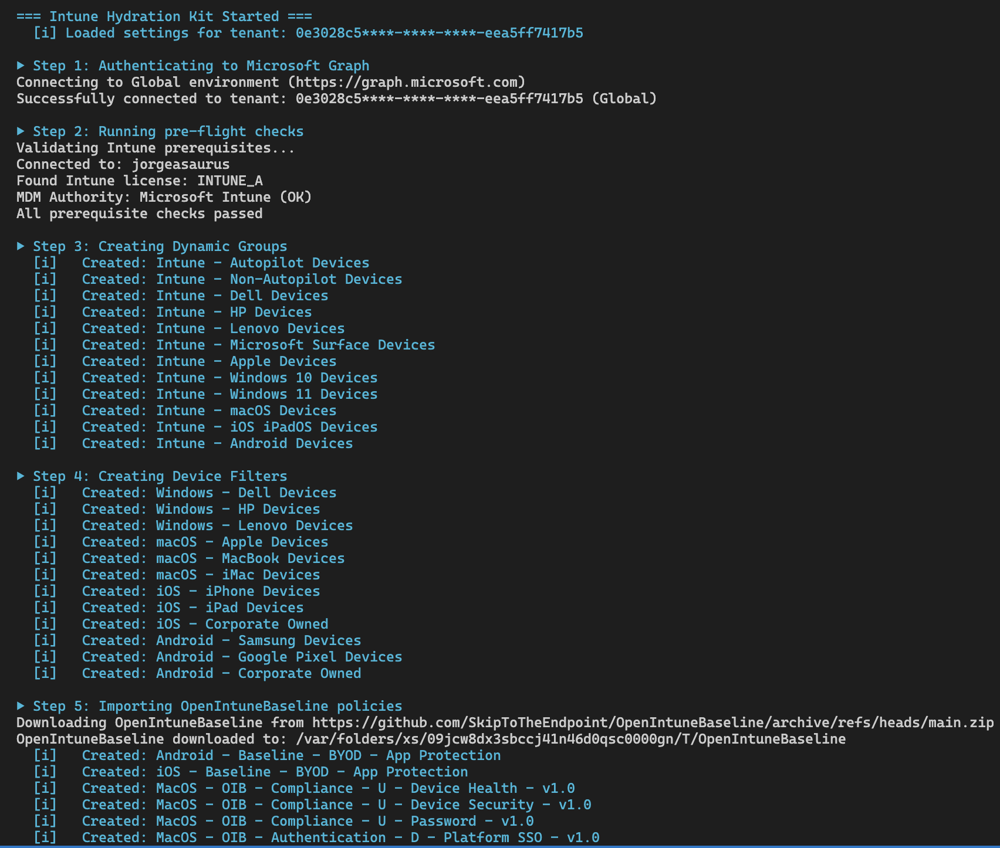

# Intune Hydration Kit

<p align="center">
  
</p>

<p align="center">
  <strong>Automate your Microsoft Intune tenant configuration with best-practice defaults</strong>
</p>

<p align="center">
  
  <a href="https://github.com/jorgeasaurus/Intune-Hydration-Kit/blob/main/LICENSE"></a>
</p>

<p align="center">
  <a href="#installation">Installation</a> •
  <a href="#quick-start">Quick Start</a> •
  <a href="#configuration">Configuration</a> •
  <a href="#app-registration-setup">App Registration</a> •
  <a href="#safety-features">Safety Features</a> •
  <a href="#troubleshooting">Troubleshooting</a>
</p>

---

## Overview

The Intune Hydration Kit is a PowerShell module that bootstraps Microsoft Intune tenants with boilerplate configurations. It automatically downloads the latest [OpenIntuneBaseline](https://github.com/SkipToTheEndpoint/OpenIntuneBaseline) policies and deploys them alongside compliance policies, dynamic groups, and more—turning hours of manual configuration into a single command.

<p align="center">
  
</p>

### What Gets Created

| Category | Count | Description |
|----------|-------|-------------|
| Dynamic Groups | 12 | Device targeting groups (OS, manufacturer, Autopilot) |
| Device Filters | 12 | Platform and manufacturer-based filters |
| Security Baselines | 70+ | OpenIntuneBaseline policies (Windows, macOS) |
| Compliance Policies | 10 | Multi-platform compliance (Windows, macOS, iOS, Android, Linux) |
| App Protection | 4 | MAM policies for iOS and Android BYOD |
| Enrollment Profiles | 2 | Autopilot deployment + Enrollment Status Page |
| Conditional Access | 13 | Starter pack policies (created disabled) |

---

## Important Warnings

> **⚠️ READ BEFORE USE**

### This Tool Can Modify Your Production Environment

- **Creates objects** in your Intune tenant (policies, groups, filters)
- **Can delete objects** when run with delete mode enabled
- **Modifies Conditional Access** policies (though always created disabled)

### Recommendations

1. **Test in a non-production tenant first** - Use a dev/test tenant before running against production
2. **Always run with `-WhatIf` first** - Preview all changes before applying them
3. **Review the settings file** - Understand what will be imported before running
4. **Have a rollback plan** - Know how to manually remove configurations if needed
5. **Backup existing configurations** - Export current settings before running

### Deletion Safety

When using delete mode (`"delete": true`), the kit will **only delete objects that it created**:
- Objects must have `"Imported by Intune-Hydration-Kit"` in their description
- Conditional Access policies must also be in `disabled` state to be deleted
- Manually created objects with the same names will NOT be deleted

---

## Features

- **Idempotent** - Safe to run multiple times; skips existing configurations
- **Dry-Run Mode** - Preview all changes with `-WhatIf` before applying
- **Safe Deletion** - Only removes objects created by this kit
- **Multi-Platform** - Supports Windows, macOS, iOS, Android, and Linux
- **OpenIntuneBaseline Integration** - Automatically downloads latest community baselines
- **Detailed Logging** - Full audit trail of all operations
- **Summary Reports** - Markdown and JSON reports of all changes

---

## Prerequisites

### Required PowerShell Version
- PowerShell 7.0 or later

### Required Modules
```powershell
Install-Module Microsoft.Graph.Authentication -Scope CurrentUser
```

> **Note:** This module uses `Invoke-MgGraphRequest` for all Graph API calls, so only the Authentication module is required.

For automated app registration setup with certificate authentication, you'll also need:
```powershell
Install-Module Microsoft.Graph.Applications -Scope CurrentUser
```

### Required Permissions
The authenticated user/app needs these Microsoft Graph permissions:
- `DeviceManagementConfiguration.ReadWrite.All`
- `DeviceManagementServiceConfig.ReadWrite.All`
- `DeviceManagementManagedDevices.ReadWrite.All`
- `DeviceManagementScripts.ReadWrite.All`
- `DeviceManagementApps.ReadWrite.All`
- `Group.ReadWrite.All`
- `Policy.Read.All`
- `Policy.ReadWrite.ConditionalAccess`
- `Application.Read.All`
- `Directory.ReadWrite.All`

---

## Installation

```powershell
git clone https://github.com/jorgeasaurus/Intune-Hydration-Kit.git
cd Intune-Hydration-Kit
Import-Module ./IntuneHydrationKit.psd1
```

---

## Quick Start

### 1. Create Your Settings File
```powershell
Copy-Item settings.example.json settings.json
```

Edit `settings.json` with your tenant details:
```json
{
    "tenant": {
        "tenantId": "your-tenant-id-here",
        "tenantName": "yourtenant.onmicrosoft.com"
    },
    "authentication": {
        "mode": "interactive"
    },
    "options": {
        "dryRun": false,
        "create": true,
        "delete": false
    }
}
```

### 3. Preview Changes (Recommended First Step)
```powershell
./Invoke-IntuneHydration.ps1 -SettingsPath ./settings.json -WhatIf
```

### 4. Run the Hydration
```powershell
./Invoke-IntuneHydration.ps1 -SettingsPath ./settings.json
```

---

## Configuration

### Settings File Options

#### Tenant Configuration
```json
"tenant": {
    "tenantId": "00000000-0000-0000-0000-000000000000",
    "tenantName": "contoso.onmicrosoft.com"
}
```

#### Authentication Modes

The kit supports three authentication methods:

| Method | Use Case | Requirements |
|--------|----------|--------------|
| Interactive | Manual runs, testing | User with required permissions |
| Certificate | Automation, CI/CD (recommended) | App registration with certificate |
| Client Secret | Automation, CI/CD | App registration with client secret |

**Interactive (recommended for testing):**
```json
"authentication": {
    "mode": "interactive",
    "environment": "Global"
}
```
Uses browser-based login. Best for manual runs and initial testing.

**Certificate (recommended for automation):**
```json
"authentication": {
    "mode": "certificate",
    "clientId": "00000000-0000-0000-0000-000000000000",
    "certificateThumbprint": "ABC123DEF456...",
    "environment": "Global"
}
```
Uses certificate-based authentication. More secure than client secrets for unattended runs.

> **Tip:** Use the included `Setup-IntuneHydrationApp.ps1` script to automatically create the app registration and certificate. See [App Registration Setup](#app-registration-setup) below.

**Client Secret (for automation):**
```json
"authentication": {
    "mode": "clientSecret",
    "clientId": "00000000-0000-0000-0000-000000000000",
    "clientSecret": "your-client-secret-value",
    "environment": "Global"
}
```
Uses app registration credentials. Best for unattended/automated runs.

> **Security Note:** Store client secrets securely. Consider using Azure Key Vault or environment variables instead of plaintext in settings files.

**Supported Cloud Environments:**

| Environment | Description |
|-------------|-------------|
| `Global` | Commercial/Public cloud (default) |
| `USGov` | US Government (GCC High) |
| `USGovDoD` | US Government (DoD) |
| `Germany` | Germany sovereign cloud |
| `China` | China sovereign cloud (21Vianet) |

#### Operation Modes

| Option | Description |
|--------|-------------|
| `dryRun` | Preview changes without applying (same as `-WhatIf`) |
| `create` | Create new configurations |
| `delete` | Delete existing kit-created configurations |

**Create mode (default):**
```json
"options": {
    "create": true,
    "delete": false
}
```

**Delete mode (cleanup):**
```json
"options": {
    "create": false,
    "delete": true
}
```

#### Selective Imports

Enable or disable specific configuration types:
```json
"imports": {
    "openIntuneBaseline": true,
    "complianceTemplates": true,
    "appProtection": true,
    "notificationTemplates": true,
    "enrollmentProfiles": true,
    "dynamicGroups": true,
    "deviceFilters": true,
    "conditionalAccess": true
}
```

---

## App Registration Setup

For automated/unattended runs, you need an Azure AD app registration with the required permissions. The included `Setup-IntuneHydrationApp.ps1` script automates this entire process.

### What the Setup Script Does

1. Connects to Microsoft Graph with admin scopes (interactive)
2. Creates the application registration (or uses existing)
3. Creates the service principal for the application
4. Generates a self-signed certificate (or uses an existing one)
5. Attaches the certificate to the application
6. Configures all required Microsoft Graph API permissions
7. Grants admin consent for all permissions
8. Verifies the connection using certificate authentication
9. Outputs the settings.json configuration values

### Quick Setup

```powershell
# Basic setup with new certificate
./Setup-IntuneHydrationApp.ps1 -TenantId "00000000-0000-0000-0000-000000000000"
```

### Setup Script Parameters

| Parameter | Description | Default |
|-----------|-------------|---------|
| `-TenantId` | **(Required)** Azure AD tenant ID (GUID) | - |
| `-ApplicationName` | Display name for the app registration | `Intune-Hydration-Kit` |
| `-CertificateSubject` | Subject name for the certificate | `CN=Intune-Hydration-Kit` |
| `-CertificateValidityMonths` | Certificate validity period (1-60 months) | `24` |
| `-ExistingCertificateThumbprint` | Use an existing certificate instead of generating new | - |
| `-NonExportable` | Create certificate with non-exportable private key | `false` |
| `-ExportCertificate` | Export certificate to .cer and .pfx files | `false` |
| `-Force` | Skip confirmation prompts | `false` |

### Setup Examples

```powershell
# Basic setup - creates app and certificate interactively
./Setup-IntuneHydrationApp.ps1 -TenantId "your-tenant-id"

# Non-exportable certificate for enhanced security
./Setup-IntuneHydrationApp.ps1 -TenantId "your-tenant-id" -NonExportable -Force

# Use an existing certificate
./Setup-IntuneHydrationApp.ps1 -TenantId "your-tenant-id" -ExistingCertificateThumbprint "ABC123..."

# Export certificate files for backup or deployment to other machines
./Setup-IntuneHydrationApp.ps1 -TenantId "your-tenant-id" -ExportCertificate

# Custom app name and certificate validity
./Setup-IntuneHydrationApp.ps1 -TenantId "your-tenant-id" `
    -ApplicationName "My-Intune-Automation" `
    -CertificateSubject "CN=My-Intune-Automation" `
    -CertificateValidityMonths 12
```

### After Setup

The script outputs the exact JSON configuration to add to your `settings.json`:

```json
{
    "tenant": {
        "tenantId": "your-tenant-id"
    },
    "authentication": {
        "mode": "certificate",
        "clientId": "app-client-id-from-output",
        "certificateThumbprint": "certificate-thumbprint-from-output",
        "environment": "Global"
    }
}
```

### Certificate Storage

- Certificates are stored in `Cert:\CurrentUser\My` by default
- Use `-ExportCertificate` to export .cer (public) and .pfx (private) files
- For deployment to other machines, export the .pfx file and import it to the target machine's certificate store

> **Security Note:** If using `-NonExportable`, the certificate private key cannot be exported or backed up. This provides stronger security but means the certificate cannot be moved to another machine.

---

## Safety Features

### Hydration Marker

All objects created by this kit include a marker in their description:
```
Imported by Intune-Hydration-Kit
```

This marker is used to:
- Identify objects created by this tool
- Prevent deletion of manually-created objects
- Enable safe cleanup operations

### Conditional Access Protection

Conditional Access policies receive additional protection:
- **Always created in `disabled` state** - Never automatically enabled
- **Deletion requires disabled state** - Cannot delete enabled CA policies
- **Manual review required** - You must manually enable policies after review

### WhatIf Support

All operations support PowerShell's `-WhatIf` parameter:
```powershell
# Preview what would be created
./Invoke-IntuneHydration.ps1 -SettingsPath ./settings.json -WhatIf
```

---

## Output and Reports

### Console Output
The script provides real-time progress with colored status indicators:
- `[i]` Info - Operation details
- `[!]` Warning - Non-fatal issues
- `Created:` - New object created
- `Skipped:` - Object already exists
- `Deleted:` - Object removed

### Log Files
Detailed logs are written to the `Logs/` directory:
```
Logs/hydration-20241127-143052.log
```

### Summary Reports
After each run, reports are generated in the `Reports/` directory:
- `Hydration-Summary.md` - Human-readable markdown report
- `Hydration-Summary.json` - Machine-readable JSON for automation

---

## Troubleshooting

### Common Issues

**"The term 'Invoke-MgGraphRequest' is not recognized"**
```powershell
# Install required modules
Install-Module Microsoft.Graph.Authentication -Force
```

**"Insufficient privileges"**
- Ensure you have Global Administrator or Intune Administrator role
- Check that all required Graph permissions are consented

**"No active Intune license found"**
- Verify Intune licenses are assigned in the tenant
- Check for INTUNE_A, INTUNE_EDU, or EMS license

**Objects not being deleted**
- Verify the object has "Imported by Intune-Hydration-Kit" in its description
- For CA policies, ensure the policy is in `disabled` state

### Debug Mode

Enable verbose logging in settings:
```json
"options": {
    "verbose": true
}
```

Or use PowerShell's verbose preference:
```powershell
$VerbosePreference = "Continue"
./Invoke-IntuneHydration.ps1 -SettingsPath ./settings.json
```

---

## Project Structure

```
Intune-Hydration-Kit/
├── Invoke-IntuneHydration.ps1    # Main orchestrator script
├── Setup-IntuneHydrationApp.ps1  # App registration setup script
├── IntuneHydrationKit.psd1       # Module manifest
├── IntuneHydrationKit.psm1       # Module loader
├── settings.example.json          # Example configuration
├── Public/                        # Exported functions
│   ├── Connect-IntuneHydration.ps1
│   ├── Import-IntuneBaseline.ps1
│   ├── Import-IntuneCompliancePolicy.ps1
│   └── ...
├── Private/                       # Internal helper functions
├── Templates/                     # Configuration templates
│   ├── Compliance/
│   ├── ConditionalAccess/
│   ├── DynamicGroups/
│   └── ...
├── Logs/                          # Execution logs
└── Reports/                       # Generated reports
```

---

## Changelog

### v0.1.4
- Added `DeviceManagementScripts.ReadWrite.All` scope for custom compliance scripts (required after Microsoft Graph API permission changes)
- Added `Application.Read.All` scope for Conditional Access policies targeting specific applications
- Added `Policy.Read.All` scope for querying existing Conditional Access policies
- Updated prerequisite checks to validate Graph permission scopes
- Removed MDM authority check from prerequisites

### v0.1.3
- Fixed image paths in README.md

### v0.1.2
- Refactored code structure for improved readability and maintainability

### v0.1.1
- Updated module manifest with correct author and company details

### v0.1.0 - Initial Release
- OpenIntuneBaseline integration (auto-downloads latest policies)
- Compliance policy templates (Windows, macOS, iOS, Android, Linux)
- App protection policies (Android/iOS MAM)
- Dynamic groups and device filters
- Enrollment profiles (Autopilot, ESP)
- Conditional Access starter pack (always created disabled)
- Safe deletion (only removes kit-created objects)
- Multi-cloud support (Global, USGov, USGovDoD, Germany, China)
- WhatIf/dry-run mode
- Detailed logging and reporting

---

## Acknowledgments

- [OpenIntuneBaseline](https://github.com/SkipToTheEndpoint/OpenIntuneBaseline) by SkipToTheEndpoint - Community-driven Intune security baselines
- Microsoft Graph PowerShell SDK team

---

## Disclaimer

This tool is provided "as-is" without warranty of any kind. Always test in a non-production environment first. The authors are not responsible for any unintended changes to your Intune tenant. Review all configurations before enabling in production.
